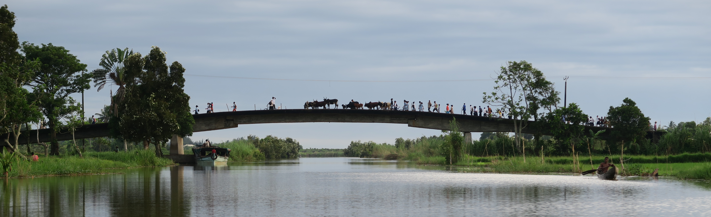

<link rel="stylesheet" href="styles.css" type="text/css">

In the **Brook Lab** in the [Department of Ecology and Evolution](https://ecologyandevolution.uchicago.edu/) at the **University of Chicago**, we work at the interface of disease ecology and conservation biology to study the dynamics of zoonotic infections, pathogens transmitted from wildlife to human hosts. 
 
 
Much of our work is focused on zoonotic infections derived from bat reservoirs, and we conduct the majority of our field studies in Madagascar.
 

 

**We are recruiting PhD students, postdocs, and field technicians! Please visit 'Join the Lab!' for more information.**

**Applicants from underrepresented backgrounds, ethnicities, genders, sexual orientations, and lifestyles are enthusiastically encouraged to apply.**