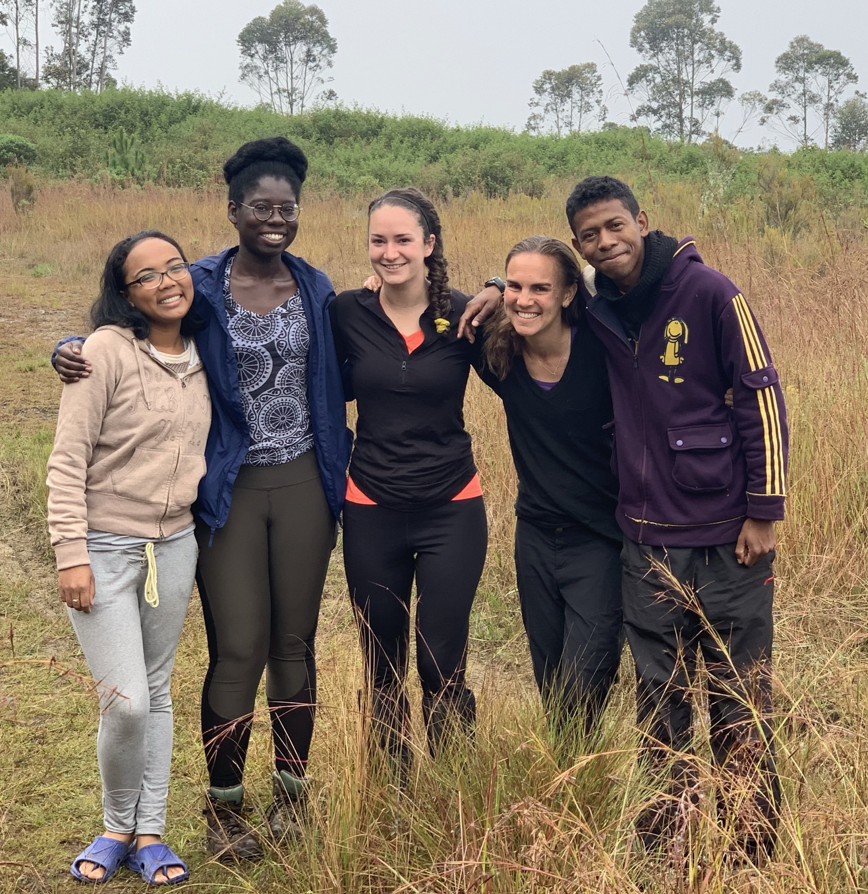

**We are recruiting PhD students, postdocs, and field technicians!**

---

### **A note on diversity and inclusion**

**We are an equal-opportunity group, committed to enacting anti-racist and anti-sexist policies to promote inclusivity in our lab, the biological sciences, and the academy. We believe that black lives matter, women's rights are human rights, and no life is illegal. Applicants from underrepresented backgrounds, ethnicities, genders, sexual orientations, and lifestyles are enthusiastically encouraged to apply to any of the positions outlined below.**
  
  
If interested, please email [cbrook@uchicago.edu](cbrook@uchicago.edu) with a brief overview of relevant experiences and interests and attach a short CV or resumé.
  
  
  
  
  
  

---

### **PhD Positions**

I will be starting as an Assistant Professor in the [Department of Ecology and Evolution](https://ecologyandevolution.uchicago.edu/) at the University of Chicago in summer 2021. I am currently recruiting graduate students to [apply](https://biosciences.uchicago.edu/admissions) by December 1, 2020 to join my new lab in autumn 2021. I'm looking for motivated students with broad interests in disease ecology, conservation biology, and/or epidemiology who are eager to undertake a multi-faceted PhD involving some combination of field study, molecular work, and dynamical modeling. If interested, please don't hesitate to reach out!

---

### **Postdocs**

I will be recruiting **two postdocs** to join my lab in summer or fall 2021. The exact specifications of the work will be flexible, but I envision that one position will involve semi-remote management of Ekipa Fanihy (see [Team](team.html)) and analysis of 7+ years of longterm Madagascar fruit bat data, while the other position will be focused on phylodynamic inference and novel virus discovery from our new Gates-funded sequencing efforts in part with [Institut Pasteur of Madagascar ](http://www.pasteur.mg/) (see [Research](research_interests.html)). I plan to advertise these positions formally in spring 2021, but if you are interested in either or both, please drop me a line to discuss timing and fit for the job.
  
  
Independent postdoctoral fellows are additionally always welcome, and I am happy to advise any interested individuals on related fellowship or grant applications. I have previous experience as both a [Miller Fellow](http://miller.berkeley.edu/) and a [Branco Weiss Fellow](https://brancoweissfellowship.org/) myself and would be delighted to help strategize an application.

---

### **Field Technicians**

In part with Ekipa Fanihy, I periodically hire **Field Technicians** (usually American post-bac students; see [Team](team.html)) to work with Malagasy graduate students catching and collecting samples from wild fruit bats in Madagascar. I have found this to be rewarding opportunity for both parties to engage in scientific and cultural exhange. Field tech positions are currently on hold due to COVID-19; however, I am hopeful that we will be able to hire new techs sometime in early-to-mid 2021. I will advertise these positions formally as they become available. In the meantime, an outdated job description from pre-pandemic is available for your perusal [here](fieldtechjob.html). Please feel free to contact me with any questions!
