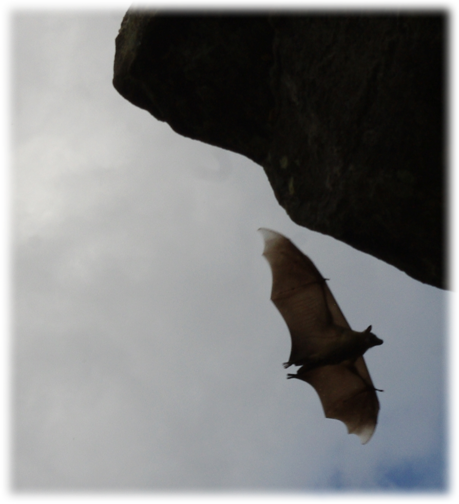
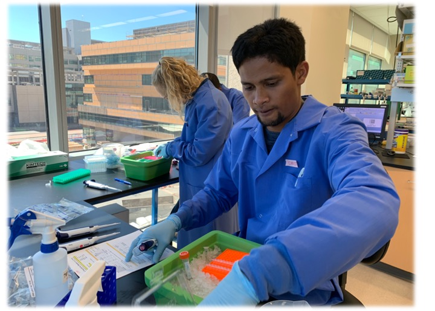
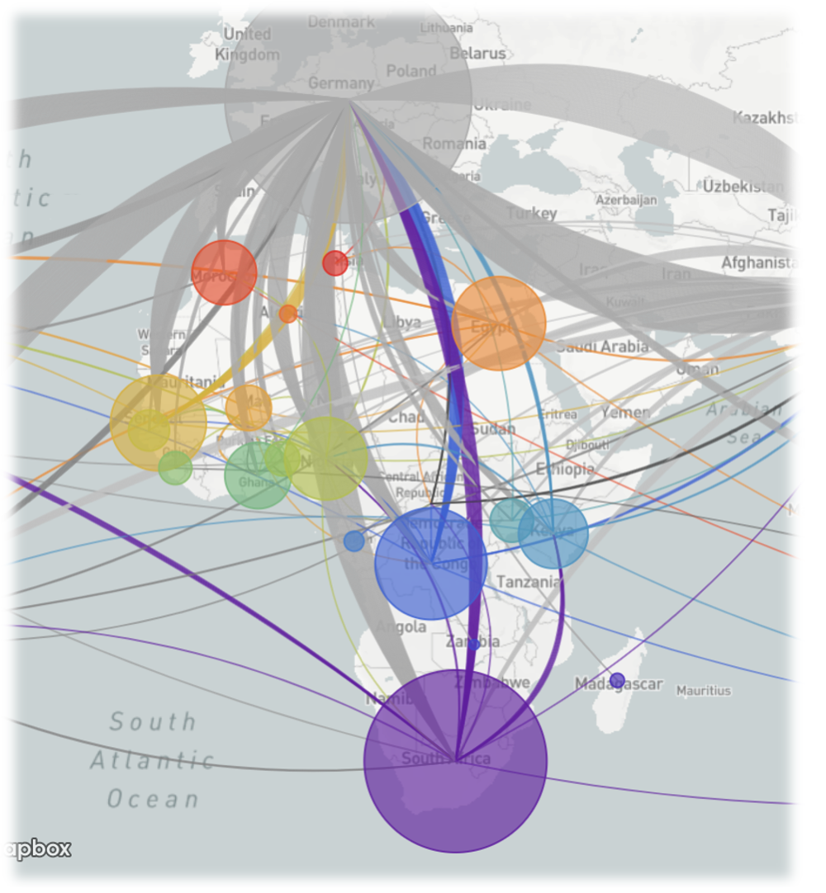
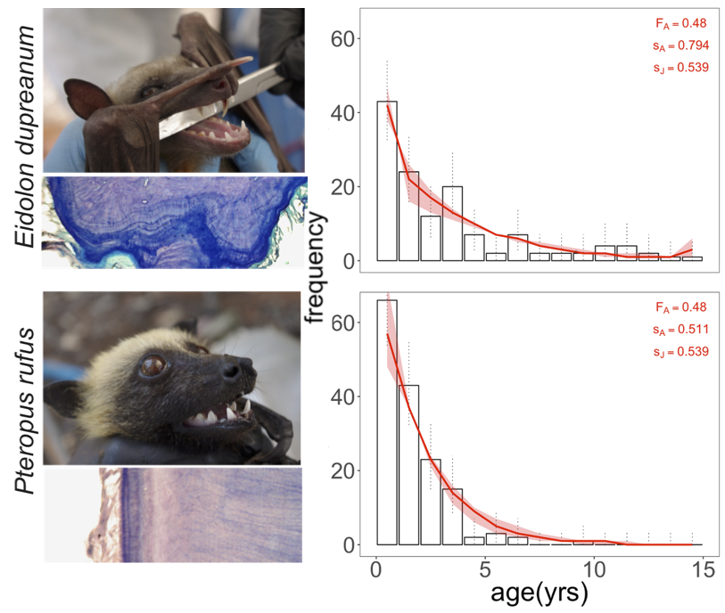

**Bats as reservoirs for emerging viral zoonoses**

Bats are  reservoir hosts for the world's most virulent emerging viral zoonoses, including Hendra and Nipah henipaviruses, Ebola and Marburg filoviruses, and SARS, MERS, and SARS-CoV-2 coronaviruses. Bats  host these viruses without experiencing extensive morbidity or mortality, leading researchers to ask whether bats might be uniquely adapted for their roles as pathogen hosts. Accumulating molecular evidence links the evolution of flight to bat viral tolerance: unique anti-inflammatory pathways in bat systems enable them to avoid oxidative damage accrued during the metabolically expensive process of flight, with cascading consequences for bat longevity and resilience to intracellular infections ([Zhang et al. 2013](https://science.sciencemag.org/content/339/6118/456), [Pavlovich et al. 2018](https://www.sciencedirect.com/science/article/pii/S0092867418304021), [Xie et al. 2018](https://www.sciencedirect.com/science/article/pii/S1931312818300416)). I bridge field ecology, cellular immunology, and quantitative epidemiology to investigate both **population-level** and **within-host** questions related to this research theme. The fitting of dynamic models to time series data represents an underlying theme in my work. I derive data from a variety of laboratory and field sources, with a particular focus on viral infections in Madagascar fruit bats. 

---

**Brook CE** and Dobson AP. 2015. Bats as ‘special’ reservoirs for emerging zoonotic pathogens. Trends in Microbiology. doi: [10.1016/j.tim.2014.12.004](https://doi.org/10.1016/j.tim.2014.12.004)

Guth S, Visher E, Boots M, and **Brook CE.** 2019. Host phylogenetic distance drives trends in virus virulence and transmissibility across the animal-human interface. Philosophical Transactions of the Royal Society. 374(1782): 20190296. doi: [10.1098/rstb.2019.0296](https://doi.org/10.1098/rstb.2019.0296).

---

**Population-level: How do bat viruses persist?**

Classic epidemiological modeling explores the dynamics of perfectly immunizing childhood infections, under which hosts are  born susceptible (S), become infectious (I), and recover (R) via immune responses retained for life. In the simplest example, infections persist maintained in a population by constant re-supply of susceptible births. Many bat species reproduce in annual or biannual birth pulses, meaning that susceptible re-supply is restricted within a year. Such a system suggests that bat viruses may be governed by more nuanced dynamics than standard SIR--be they longer infectious periods, latent periods for persistent infections, or periodic waning immunity ([Plowright et al. 2016](https://doi.org/10.1371/journal.pntd.0004796)). To elucidate these dynamics, I fit candidate mechanistic models to age-structured prevalence and seroprevalence data, collected monthly with the help of the inimitable [Ekipa Fanihy](team.html). We find support for assumptions of waning antobody-mediated immunity but data are not yet finescale enough to distinguish between hypotheses of waning immunity and reinfection vs. persistent infection and periodic viral shedding. As part of an [NIH](http://grantome.com/grant/NIH/R01-AI129822-01)- and [DARPA](https://www.bat1health.org/)-funded research initiative, we are longitudinally sampling Malagasy fruit bat populations to construct the time series needed to parse our hypotheses.

---

**Brook CE**, Ranaivoson HC, Broder CC, Cunningham AA, Héraud JM, Peel AJ, Gibson L, Wood JLN, Metcalf CJE\*, and Dobson AP\*. 2019. Disentangling serology to elucidate henipa- and filovirus transmission in Madagascar fruit bats. Journal of Animal Ecology. doi: [10.1111/1365-2656.12985](https://doi.org/10.1111/1365-2656.12985). \*=equal senior contributions.

---

**Within-host: Why are bat viruses so virulent?**

Recent work has demonstrated that some species of Old World Fruit Bat constitutively express the cytokine, Interferon-alpha, meaning that they have perpetually-primed antiviral immune systems ([Zhou et al. 2016](http://www.pnas.org/content/113/10/2696)). This unique immunity likely plays a role in bats' capacities to resist or tolerate viral infections that cause extreme virulence in other mammalian hosts. In collaboration with Albert Einstein College of Medicine, I studied the dynamics of bat viruses *in vitro*, modeling the spread of infection across a monolayer of bat cells under differing assumptions of innate antiviral immune status. We found that infections established under robust antiviral conditions in bat cell lines generated parameter estimates for within-host viral propagation rates a full order of magnitude higher than those estimated in the absent of an effect for immunity. Such findings suggest that viruses evolved in highly antiviral immune systems--like those demonstrated for bats--may achieve elevated replication rates likely to cause extreme pathology upon emergence into a host lacking constitutive immune defenses. As a Miller Fellow, I am further exploring the impact of a generalist anti-viral immune systems on the evolution of viral virulence, using a theoretical, adaptive dynamics approach.

---

**Brook CE**, Boots M, Chandran KC, Dobson AP, Drosten C, Graham AL, Grenfell BT, Müller MA, Ng M, Wang LF, and van Leeuwen A. 2020. Accelerated viral dynamics in bat cell lines, with implications for zoonotic emergence. eLife. doi: [10.7554/eLife.48401](https://elifesciences.org/articles/48401).

*Watch the the National Science Foundation's '4 Awesome Discoveries' video summary of our eLife paper here:*

<iframe width="350" height="280" src="https://www.youtube.com/embed/y5_g_pjf0eE" frameborder="0" allow="accelerometer; autoplay; encrypted-media; gyroscope; picture-in-picture" allowfullscreen></iframe>

---

**Cross-scale: Metagenomic Next Generation Sequencing (mNGS) to identify zoonotic etiology of undiagnosed human fevers in Madagascar**

I am a recent recipient of a [Bill & Melinda Gates Foundation Grand Challenges Explorations grant](https://gcgh.grandchallenges.org/grant/metagenomics-and-etiology-zoonotic-disease-deciphering-bat-human-viral-transmission-madagascar) for ‘Metagenomic Next Generation Sequencing for Pathogen Identification in Low-Income Countries.’ In part with this award, Malagasy colleagues from the [Institut Pasteur of Madagascar](http://www.pasteur.mg/) (IPM) and myself trained in library preparation and metagenomic Next Generation Sequencing at Chan Zuckerberg Biohub (San Francisco, CA) in July 2019. In March 2020, we received an Illumina sequencing machine at IPM and are currently undertaking sequencing of bat excretia from our longitudinal study concurrently with sequencing of samples from undiagnosed febrile human patients reporting to public hospitals across Madagascar. Our goal is to describe the landscape of potential viral zoonoses in biological samples from wild bats and identify any bat-derived zoonotic viruses responsible for human fever in Madagascar.

---

**Phylodynamics: Using NGS to inform COVID-19 outbreak response in Madagascar**

Madagascar reported its first case of COVID-19 on March 20, 2020 and has since diagnosed several more than 16,000 cases of COVID-19 from just under 80,000 tests (daily updated data available at [COVID-19 Madagascar Dashboard](https://www.covid19mg.org/dashboard_EN.html). I am a recent recipient of a grant from UC Berkeley's [Innovative Genomics Institute](https://innovativegenomics.org/projects/covid-19-in-madagascar-next-generation-sequencing/) to use the NGS tools outlined above at Institut Pasteur of Madagascar to sequence SARS-CoV-2 in country. Our main goals are to use these sequence data to: [1] Estimate timing of the origin of the COVID-19 epidemic in Madagascar, [2] Estimate the underreporting rate of qPCR-based positive case counts in Madagascar, and [3] Decipher patterns of cross-island connectivity and community spread across the island. We have recently released the two first sequences of SARS-COV-2 from human cases in Madagascar to GISAID, and they are available for viewing on [Nextstrain](https://nextstrain.org/sars-cov-2/). Stay tuned for more mechanistic insights as we expand our sequencing efforts soon!

---

**Conservation: What population trends do we predict for threatened Madagascar fruit bats?**

In part with our longitudinal field studies, we collect lower left premolar teeth from live-caught Malagasy *Pteropus rufus* and *Eidolon dupreanum* under anesthesia. Fruit bats put down annual layers of a tissue called *cementum* in their teeth; thus, from slicing, staining, and examining teeth in cross section, we can learn a fruit bat's age. In addition to facilitating analyses of transmission dynamics for bat-borne pathogens, age data allow us to build age-frequency curves from which we can infer annual mortality rates and make population projections, using Leslie matrix modeling approaches. To date, our studies suggest that the Madagascan flying fox, *Pteropus rufus,* is in serious population decline. We are currently working with a local conservation NGO, [Madigasikara Voakajy](https://www.madagasikara-voakajy.org/), to develop conservation-oriented intervention plans for this species.

---

**Brook CE**, Ranaivoson HC, Andriafidison D, Ralisata M, Razafimanahaka J, Héraud JM, Dobson AP, and Metcalf CJE. 2019. Population trends for two Malagasy fruit bats. Biological Conservation. 234: 165-171. doi: [10.1016/j.biocon.2019.03.032](https://doi.org/10.1016/j.biocon.2019.03.032).

---
